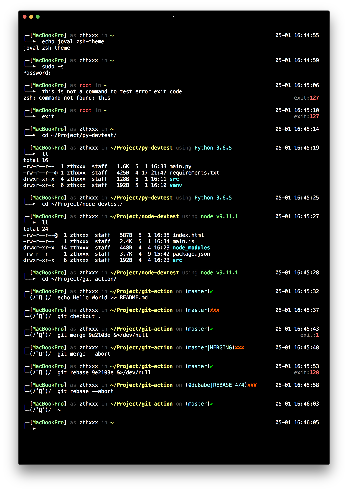

# jovial - feel jovial with this theme

## Feature

- pretty face
- state
  - Host and User
  - current path
  - development environment segment
  - git branch, git action
  - time at the line end
  - venv
- plugin (auto be installed)
  - git
  - autojump
  - urltools


## Preview




## Install

if u are always login as **root**, pls use this command:

```bash
curl -sSL git.io/jovial | bash
```

otherwise, use this below:

```bash
curl -sSL git.io/jovial | sudo bash -s $USER
```

NOTE: it will also install `zsh` and `oh-my-zsh` if u lack them.


## Author

**SSlaunch.sh** © [zthxxx](https://github.com/zthxxx), Released under the **[MIT](./LICENSE)** License.

> Blog [@zthxxx](https://blog.zthxxx.com) · GitHub [@zthxxx](https://github.com/zthxxx)

