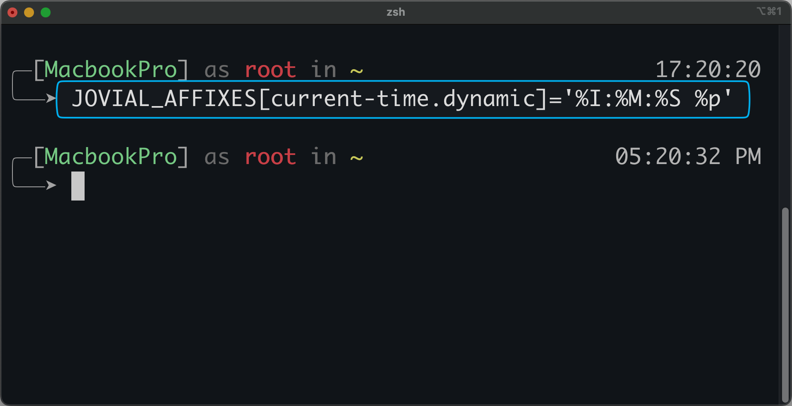

<h1 align="center">Jovial</h1>

<p align="center">
  
  
  
  
  
  
  
</p>

<p align="center">
  <strong>A clean and fast ZSH theme with responsive design, providing simple yet powerful features</strong>
</p>

## Overview

<p align="center">
  
</p>

Jovial is designed for users who want a straightforward ZSH experience without unnecessary complexity. Whether you're new to ZSH or an experienced user, Jovial offers an intuitive interface with helpful features that enhance your command-line workflow.

<br />

## TOC

<p align="center">
  <span><strong>　·　</strong></span>
  <a href="#features--preview"><strong>Features</strong></a>
  <span>　/　</span>
  <a href="#plugins-integration"><strong>Plugins</strong></a>
  <span>　/　</span>
  <a href="#install"><strong>Install</strong></a>
  <span>　/　</span>
  <a href="#customization"><strong>Customization</strong></a>
  <span>　/　</span>
  <a href="#benchmark"><strong>Benchmark</strong></a>
  <span>　/　</span>
  <a href="#migration"><strong>Migration</strong></a>
  <span><strong>　·　</strong></span>
</p>

<br />

## Features & Preview

### Complete Feature Set

Jovial comes packed with useful features. Here's how it looks with all features enabled:

<p align="center">
  
</p>


The description of each part:

<p align="center">
  
</p>


### Responsive Design

Each part of the prompt is **"responsive"** to the terminal window's width, so you can safely use it in a narrow terminal.

<!-- ./docs/jovial-responsive-desigin.mp4 -->
<div><video controls muted autoplay loop src="https://user-images.githubusercontent.com/15135943/148246834-08ecbbfc-6d0e-4c25-96b5-3638b32a4a28.mp4"></video></div>


### Git Actions State

In addition to the basic git state (branch / tag / hash, dirty or clean),

there are also some prompts to hint that you are in **merge** / **rebase** / **cherry-pick** now with conflict or not.

Note that all git states will be **updated asynchronously**, so this theme is **pretty fast** even in a huge git repo.

<p align="center">
  
</p>


### Development Environment Detection

It will detect and show your development programming language and version in the current working directory, 

support Python, Conda, NodeJs, Golang, PHP out-of-box, such as:

<p align="center">
  
</p>

#### venv environment for Python:

Support detecting the `venv`, `virtualenv`, `conda` environment activated by default.

For `conda` (miniconda), you need set `conda config --set changeps1 false` to avoid conda auto change the theme's prompt.

### Show Execution Elapsed Time

<p align="center">
  
</p>


## Plugins Integration

> These integrated plugins below will be auto-setup by the install script. You can see the `install.zsh-plugins` function in [installer.sh](https://github.com/zthxxx/jovial/blob/master/installer.sh)

- **[jovial](https://github.com/zthxxx/jovial/blob/master/jovial.plugin.zsh)**: Jovial plugin defines some utility functions and aliases. You can see them in [jovial.plugin.zsh](https://github.com/zthxxx/jovial/blob/master/jovial.plugin.zsh)
- **[git](https://github.com/ohmyzsh/ohmyzsh/tree/master/plugins/git)**: Short aliases for commonly used commands
- **[autojump](https://github.com/wting/autojump)**: Allows you to use `j <keyword>` to jump to the full path folder
- **[bgnotify](https://github.com/ohmyzsh/ohmyzsh/tree/master/plugins/bgnotify)**: Background notifications for long-running commands
- **[zsh-history-enquirer](https://github.com/zthxxx/zsh-history-enquirer)**: Widget for history searching, enhances `Ctrl+R`
- **[zsh-autosuggestions](https://github.com/zsh-users/zsh-autosuggestions)**: Shell auto-completion
- **[zsh-syntax-highlighting](https://github.com/zsh-users/zsh-syntax-highlighting)**: User input syntax highlighting

<br />

## Install

Just run the simple one-line install command:

```bash
curl -sSL https://github.com/zthxxx/jovial/raw/master/installer.sh | sudo -E bash -s ${USER:=`whoami`}
```

> **Note**: The install script is designed to be **"Idempotent"**, so you can safely execute it multiple times.


> **Tips**: You may want to use some **http proxy**. Just export proxy variables before running the install command,
>
> 　　like: `export all_proxy=http://127.0.0.1:1086`
>
> 　　(it's equal to `export http_proxy=http://127.0.0.1:1086 http_proxys=http://127.0.0.1:1086`)


Here is what the install command and script do:

- Explain the command:
  - **`sudo`**: Ensures the script runs with access to install packages and change the default login shell
  - **`-E`**: Passes through environment variables while using sudo, to receive variables like `http_proxy`
  - **`-s $USER`**: Passes the parameters to the script, which is the real target user for installation

- The script performs these steps:
  - If **`zsh`** or **`oh-my-zsh`** is not found, it will install them
  - Changes the default login shell to **`zsh`**
  - Downloads the **jovial** theme/plugin files in the **oh-my-zsh** custom folder
  - Installs [**integrated plugins**](#plugins-integration) via the local package manager
  - Automatically **rewrites** the `ZSH_THEME` and `plugins` variables in the user's **`.zshrc`**


<br />


### Install with [Antigen](https://github.com/zsh-users/antigen)

[Antigen](https://github.com/zsh-users/antigen) is a _**theme/plugin manager for zsh**_ that uses simple **declarative configuration**.

With Antigen, installing Jovial **without sudo permission** is easy. 

Just download Antigen and **copy** the example below into your **`~/.zshrc`**,
reload zsh, and Antigen will automatically download everything only during initialization.

Download Antigen:

```bash
mkdir -p ~/.antigen && curl -SL https://github.com/zsh-users/antigen/raw/develop/bin/antigen.zsh -o ~/.antigen/antigen.zsh
```

Example for **`~/.zshrc`** with Antigen:

> You can manually copy this below into your `~/.zshrc` file, or use the command to download and append:
>
> `curl -SL https://github.com/zthxxx/jovial/raw/master/examples/antigen.zshrc >> ~/.zshrc`


```zsh
# ~/.zshrc

# [Antigen](https://github.com/zsh-users/antigen), 
# a theme/plugin manager for zsh that uses simple declarative configuration.

# Load Antigen
source ~/.antigen/antigen.zsh

# Basic recommended for Antigen
antigen use oh-my-zsh
antigen bundle git
antigen bundle autojump
antigen bundle colored-man-pages
antigen bundle zsh-users/zsh-completions
antigen bundle zsh-users/zsh-autosuggestions
antigen bundle zsh-users/zsh-syntax-highlighting

# Load the Jovial theme and plugins
antigen theme zthxxx/jovial
antigen bundle zthxxx/jovial
antigen bundle zthxxx/zsh-history-enquirer


# Any other plugins need to be set before `antigen apply`

# After all, tell Antigen that you're done, then Antigen will start
antigen apply

```


Then reload zsh to load Antigen with the Jovial theme:

```bash
exec zsh -il
```


Note that you also need to manually install other plugin bin files like:

```bash
sudo apt install -y autojump terminal-notifier source-highlight
```


### Install with Fig

[Fig](https://fig.io) adds apps, shortcuts, and autocomplete to your existing terminal.

Install the `jovial` theme in just one click.

<a href="https://fig.io/plugins/other/jovial_zthxxx" target="_blank"></a>


### Manually Install Without oh-my-zsh

First, you need to download the [jovial.zsh-theme](https://github.com/zthxxx/jovial/blob/master/jovial.zsh-theme) file manually. For example, using `curl`:

```bash
curl -sSL "https://github.com/zthxxx/jovial/raw/master/jovial.zsh-theme" -o ~/.config/jovial.zsh-theme
```

Then, add these zsh settings in your `~/.zshrc` and load the theme file:

```zsh
# ~/.zshrc

source ~/.config/jovial.zsh-theme
```

Finally, don't forget to change the default login shell to `zsh`. You can use the `chsh` command:

```zsh
sudo chsh -s `command -v zsh` $USER
```

### Upgrade


#### Using Antigen

With Antigen, it's simple to update the `jovial` theme by using `antigen update`:

```bash
antigen update zthxxx/jovial
```

Note that this ONLY updates the `jovial` theme, without any other plugins.

To update other plugins, you need to use the `antigen update` command on the other plugin names again.

#### Using the Install Script

Since the install script is designed to be **"Idempotent"**, if you want to upgrade the Jovial theme, run the install command again.

If you want to upgrade manually without the install command, just download and override the `jovial.zsh-theme` file again.

Changelogs can be found in [CHANGELOG.md](./CHANGELOG.md), and the current version you are using can be seen by running `echo ${JOVIAL_VERSION}`.

> NOTE: Pay attention to the [tips for Migration / Breaking Changes](#migration)

<br />

## Customization

All the elements / symbols / colors can be easily customized by overriding theme variables in `~/.zshrc`

These variables are designed for customization:
- [`JOVIAL_SYMBOL`](#symbols)
- [`JOVIAL_PALETTE`](#colors)
- [`JOVIAL_PROMPT_ORDER`](#order-of-parts)
- [`JOVIAL_PROMPT_PRIORITY`](#priority-of-parts)
- [`JOVIAL_AFFIXES`](#affixes)
- [`JOVIAL_EXEC_THRESHOLD_SECONDS`](#execute-elapsed)
- [`JOVIAL_DEV_ENV_DETECT_FUNCS`](#detect-development-env)


You can find their default values in [jovial.zsh-theme](https://github.com/zthxxx/jovial/blob/master/jovial.zsh-theme) (`~/.oh-my-zsh/custom/themes/jovial.zsh-theme`)

### Symbols

All the default symbols are defined as:

```zsh
JOVIAL_SYMBOL=(
    corner.top    '╭─'
    corner.bottom '╰─'

    git.dirty '✘✘✘'
    git.clean '✔'

    arrow '─➤'
    arrow.git-clean '(๑˃̵ᴗ˂̵)و'
    arrow.git-dirty '(ﾉ˚Д˚)ﾉ'
)
```

You can override symbols by assigning the variable with a key in `JOVIAL_SYMBOL`, such as arrows:

```zsh
# ~/.zshrc

JOVIAL_SYMBOL[arrow]='->'
JOVIAL_SYMBOL[arrow.git-clean]='->'
JOVIAL_SYMBOL[arrow.git-dirty]='->'
```


### Colors

Override keys in `JOVIAL_PALETTE` like `JOVIAL_SYMBOL` above.

All the default colors are defined as:

```zsh
# jovial theme colors mapping
# use `sheet:color` plugin function to see the color table
# https://zsh.sourceforge.io/Doc/Release/Prompt-Expansion.html#Visual-effects
JOVIAL_PALETTE=(
    # hostname
    host '%F{157}'

    # common user name
    user '%F{253}'

    # only root user
    root '%B%F{203}'

    # current work dir path
    path '%B%F{228}%}'

    # git status info (dirty or clean / rebase / merge / cherry-pick)
    git '%F{159}'

    # virtual env activate prompt for python
    venv '%F{159}'

    # current time when prompt render, pin at end-of-line
    time '%F{254}'

    # elapsed time of last command executed
    elapsed '%F{222}'

    # exit code of last command
    exit.mark '%F{246}'
    exit.code '%B%F{203}'

    # 'conj.': short for 'conjunction', like as, at, in, on, using
    conj. '%F{102}'

    # shell typing area pointer
    typing '%F{252}'

    # for other common case text color
    normal '%F{252}'

    success '%F{040}'
    error '%F{203}'
)
```

**🧐 Feeling overwhelmed with those variables and numbers?**

Well, `%B` sets the font to **bold** style,

and `%F{xxx}` / `%K{xxx}` is the color sheet for **font** / **background**.

For example, `%F{015}` sets the font color to "white", and  `%F{123}` sets the font color close to "cyan".

Quick reference:

```text
%F{xxx}    => foreground color (text color)
%K{xxx}    => background color (color-block)
%B         => **bold**
%U         => underline
```


**🤓 So, where is the color sheet?**

You can run the `sheet:color` function, which is in [jovial.plugin.zsh](https://github.com/zthxxx/jovial/blob/master/jovial.plugin.zsh), to display the color sheet in your terminal.

It will look like this:

<p align="center">
  
</p>

### Order of Parts

Prompt parts display order can be configured with `JOVIAL_PROMPT_ORDER`. Items are displayed from left to right in the Jovial theme at the first line.

Defaults are:

```zsh
JOVIAL_PROMPT_ORDER=( host user path dev-env git-info )
```

### Priority of Parts

In the `responsive design`, prompt parts can be set with a priority list using `JOVIAL_PROMPT_PRIORITY`.

Items are prioritized from high to low, deciding whether to still display while the terminal width is insufficient.

Defaults are:

```zsh
JOVIAL_PROMPT_PRIORITY=(
    path
    git-info
    user
    host
    dev-env
)
```

> The highest priority element will always be displayed.
>
> `current-time` will always auto-detect remaining spaces; it's the lowest priority.

You can change the order of them to obtain different effects of responsive design.

If you want to disable some parts, just remove them from the priority list.

### Affixes

Affixes of the Jovial prompt parts can be overridden in the same way as above.

Defaults are:

```zsh
JOVIAL_AFFIXES=(
    host.prefix            '${JOVIAL_PALETTE[normal]}['
    # hostname/username use `Prompt-Expansion` syntax by default
    # but you can override it with a simple constant string
    hostname               '${(%):-%m}'
    host.suffix            '${JOVIAL_PALETTE[normal]}] ${JOVIAL_PALETTE[conj.]}as'

    user.prefix            ' '
    username               '${(%):-%n}'
    user.suffix            ' ${JOVIAL_PALETTE[conj.]}in'

    path.prefix            ' '
    current-dir            '%~'
    path.suffix            ''

    dev-env.prefix         ' '
    dev-env.suffix         ''

    git-info.prefix        ' ${JOVIAL_PALETTE[conj.]}on ${JOVIAL_PALETTE[normal]}('
    git-info.suffix        '${JOVIAL_PALETTE[normal]})'

    venv.prefix            '${JOVIAL_PALETTE[normal]}('
    venv.suffix            '${JOVIAL_PALETTE[normal]}) '

    exec-elapsed.prefix    ' ${JOVIAL_PALETTE[elapsed]}~'
    exec-elapsed.suffix    ' '

    exit-code.prefix       ' ${JOVIAL_PALETTE[exit.mark]}exit:'
    exit-code.suffix       ' '

    current-time.prefix    ' '
    # datetime format provide by [`strftime(3)`](https://www.man7.org/linux/man-pages/man3/strftime.3.html)
    current-time.dynamic   '%H:%M:%S'
    current-time.suffix    ' '
)
```

Note that all `JOVIAL_AFFIXES` variable values wrapped in `${...}` will be subject to `shell Prompt-Expansion` once at first load as `zsh prompt`. **The exception to this is current-time.dynamic, which is expanded on every prompt re-draw.**

So keep **Single Quotes** for the values you want to override in your `.zshrc` file:

```zsh
# ~/.zshrc
JOVIAL_AFFIXES[user.suffix]=' ${JOVIAL_PALETTE[conj.]}in'
```

And you can use **Double Quotes** in your terminal to see the effect immediately for adjusting the theme.

```zsh
# in terminal
$ JOVIAL_AFFIXES[user.suffix]=" ${JOVIAL_PALETTE[conj.]}in"
```

To set the time formatter string, you can set:

```zsh
# ~/.zshrc

# 24 hour format (default)
JOVIAL_AFFIXES[current-time.dynamic]='%H:%M:%S'

# 12 hour format
JOVIAL_AFFIXES[current-time.dynamic]='%I:%M:%S %p'
```

<p align="center">
  
</p>

### Execute Elapsed

Default is:

```zsh
JOVIAL_EXEC_THRESHOLD_SECONDS=4
```

This threshold is the number of seconds for the last command's execution elapsed time. It will pin the info if the threshold is reached.

Set to `-1` if you want to disable displaying the time.

<p align="center">
  
</p>

### Detect Development Environment

Each item in `JOVIAL_DEV_ENV_DETECT_FUNCS` is the name of a function to detect the development environment.

You can append some custom functions for other programming languages (such as Erlang), like this:

```zsh
# ~/.zshrc

JOVIAL_DEV_ENV_DETECT_FUNCS+=( your-function-name )
```

Or disable it by setting an empty list:

```zsh
# ~/.zshrc

JOVIAL_DEV_ENV_DETECT_FUNCS=()
```


### Font Recommended

(No need to install any specific fonts; these usually come with the OS)

- `Monaco` in iTerm2
- `Menlo` in VSCode
- `JetBrains Mono` in JetBrains IDEs

Just the most common monospaced fonts, no need for any special font.

> NOTE: Also remember to set the font line-height to 1.0

### Advanced Configuration

For advanced users who want to extend Jovial's functionality:

- Custom development environment detection can be added through the `JOVIAL_DEV_ENV_DETECT_FUNCS` array
- Response time optimizations can be achieved by adjusting the git status update frequency
- Shell integration can be customized by modifying the prompt expansion variables

<br />

## Benchmark

By asynchronously updating the git status, it's very fast in rendering and interaction.

On average, the Jovial theme only takes **4ms** per render.

Running the Jovial theme 10 times in [benchmark.zsh](./dev/benchmark.zsh), you can get results like this:

```zsh
$ zsh -il dev/benchmark.zsh

( for i in {1..10}; do; theme.render; done; )  0.01s user 0.02s system 95% cpu 0.039 total
```

<br />


## Changelog

See [CHANGELOG.md](./CHANGELOG.md)

<br />

## Migration

> Run `echo ${JOVIAL_VERSION}` in the terminal to see what version you are using now.

### From v1 to v2

There are some breaking changes for customization.

Some customized variables and functions have been renamed:

- Variable `JOVIAL_ARROW` => `JOVIAL_SYMBOL[arrow]`
- Function `_jov_type_tip_pointer` => `@jov.typing-pointer`
- Arrows can now be replaced with variables `JOVIAL_SYMBOL[arrow.git-clean]` and `JOVIAL_SYMBOL[arrow.git-dirty]`
- Some keys in `JOVIAL_PROMPT_PRIORITY` have been renamed: `git_info` => `git-info`, `dev_env` => `dev-env`

<br />

## Author

**Jovial** © [zthxxx](https://github.com/zthxxx), Released under the **[MIT](./LICENSE)** License.

> Blog [@zthxxx](https://blog.zthxxx.me) · GitHub [@zthxxx](https://github.com/zthxxx)
