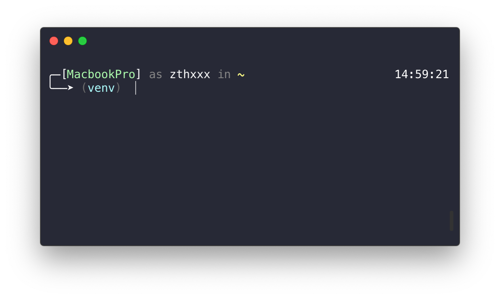
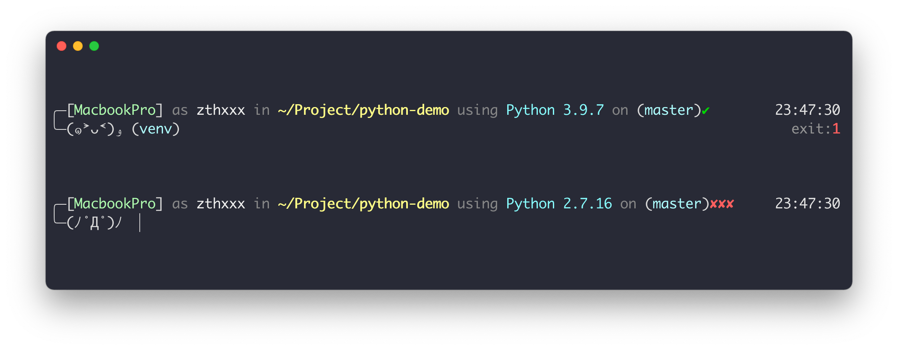
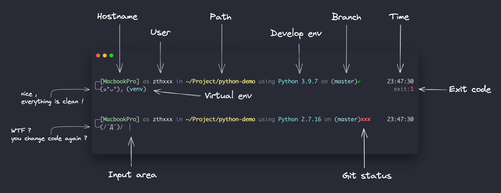
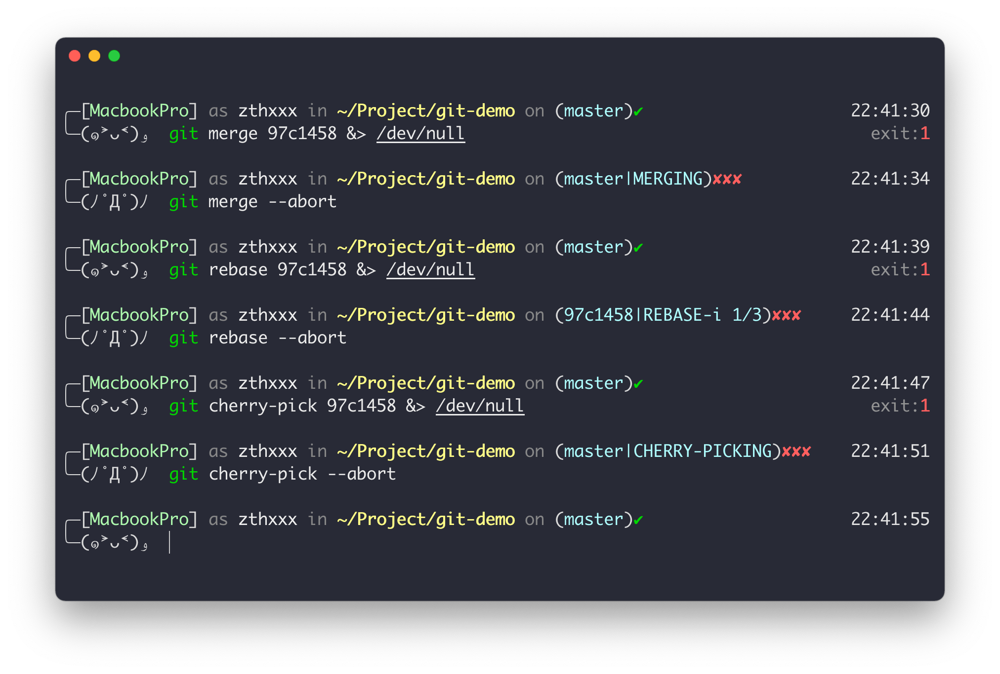
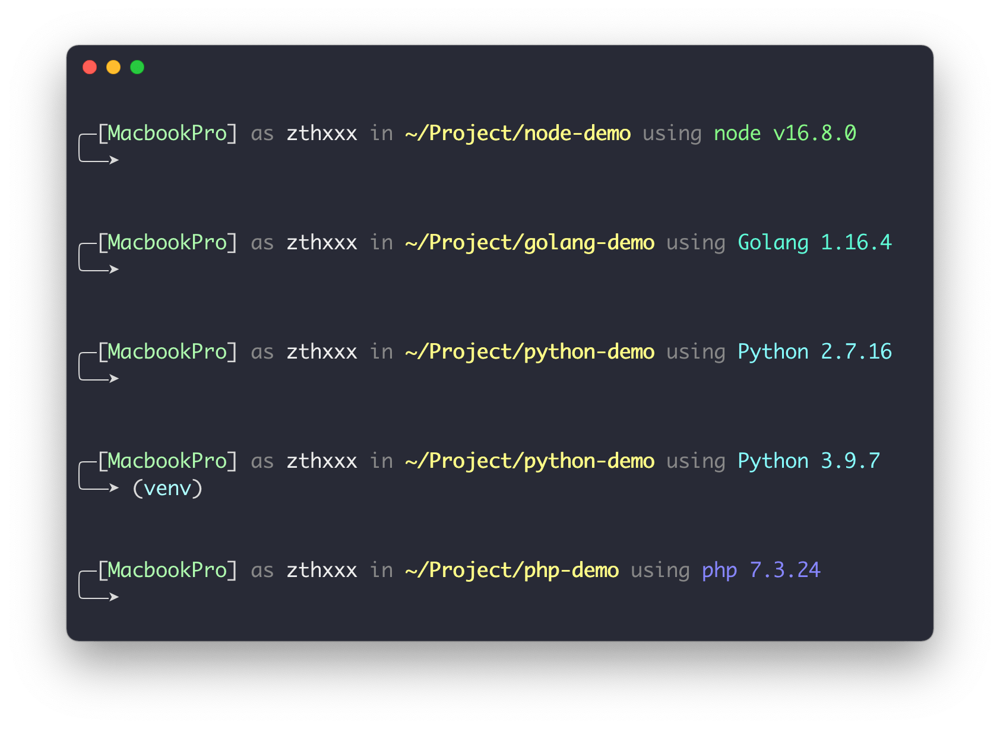
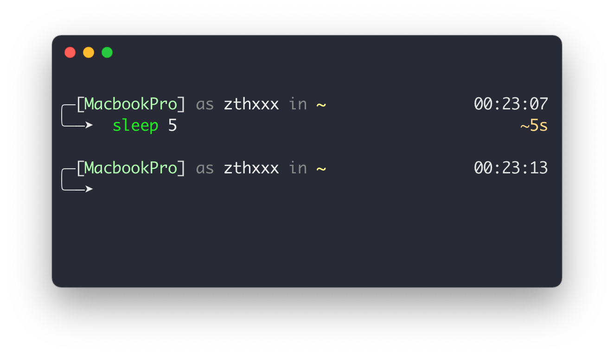

<h1 align="center">Jovial</h1>

<p align="center">
  
  
  
  
  
  
</p>

<p align="center">
  <strong>A lovely zsh theme with responsive-design, it's pretty fast, keep simple but useful</strong>
</p>

## Glance

<p align="center">
  
</p>

That's for people **who don't want make trouble out of nothing in zsh, and just look for a handy theme**.

So we make everything easy to use, even if you're new to zsh.

First, **quick install** is convenient with only a simple one-line command:

```bash
curl -sSL https://github.com/zthxxx/jovial/raw/master/installer.sh | sudo -E bash -s ${USER:=`whoami`}
```

> for more install details see the **[Install section](#install)**; (manually install or without oh-my-zsh is okay)
>
>
> custom colors/symbols is easy, see **[Customization section](#customization)**;

<br />

## TOC

<p align="center">
  <span><strong>　·　</strong></span>
  <a href="#features--preview"><strong>Features</strong></a>
  <span>　/　</span>
  <a href="#plugins-integration"><strong>Plugins</strong></a>
  <span>　/　</span>
  <a href="#install"><strong>Install</strong></a>
  <span>　/　</span>
  <a href="#customization"><strong>Customization</strong></a>
  <span>　/　</span>
  <a href="#benchmark"><strong>Benchmark</strong></a>
  <span>　/　</span>
  <a href="#migration"><strong>Migration</strong></a>
  <span><strong>　·　</strong></span>
</p>

<br />

## Features & Preview

### whole ability

As mentioned above, **jovial** theme has many useful abilities, its full display likes:

<p align="center">
  
</p>


The description of each parts:

<p align="center">
  
</p>


### responsive design

Each parts of prompt is **"responsive"** with terminal windows width, so you can safely use it in narrow terminal.

<!-- ./docs/jovial-responsive-desigin.mp4 -->
<div><video controls muted autoplay loop src="https://user-images.githubusercontent.com/15135943/148246834-08ecbbfc-6d0e-4c25-96b5-3638b32a4a28.mp4"></video></div>


### git actions state

In addition to the basic git state (branch / tag / hash, dirty or clean),

there are also some prompts to hint that you are in **merge** / **rebase** / **cherry-pick** now with conflict or not.

Note that all git state will be **update in asynchronous**, so that this theme is **pretty fast** even in a huge git repo.

<p align="center">
  
</p>


### development env detecting

It will detect to show your development programming language and version in current working directory, such as:

<p align="center">
  
</p>


### show execute elapsed

<p align="center">
  
</p>


## Plugins Integration

> These integrated plugins below will be auto setup by the install script, you can see the `install.zsh-plugins` function in [installer.sh](https://github.com/zthxxx/jovial/blob/master/installer.sh)

- **[jovial](https://github.com/zthxxx/jovial/blob/master/jovial.plugin.zsh)**: jovial plugin defined some utils functions and alias, you can see in [jovial.plugin.zsh](https://github.com/zthxxx/jovial/blob/master/jovial.plugin.zsh)
- **[git](https://github.com/ohmyzsh/ohmyzsh/tree/master/plugins/git)**: some short alias for commonly used command
- **[autojump](https://github.com/wting/autojump)**: make you can use `j <keyword>` to jump to the full path folder
- **[bgnotify](https://github.com/ohmyzsh/ohmyzsh/tree/master/plugins/bgnotify)**: background notifications for long running commands
- **[zsh-history-enquirer](https://github.com/zthxxx/zsh-history-enquirer)**: widget for history searching, enhance `Ctrl+R`
- **[zsh-autosuggestions](https://github.com/zsh-users/zsh-autosuggestions)**: shell auto-completion
- **[zsh-syntax-highlighting](https://github.com/zsh-users/zsh-syntax-highlighting)**: user input syntax highlighting

<br />

## Install

Just run the simple one-line install command:

```bash
curl -sSL https://github.com/zthxxx/jovial/raw/master/installer.sh | sudo -E bash -s ${USER:=`whoami`}
```

> **Note**: The install script is designed to be **"Idempotent"**, so you can safely execute it multiple times.


> **Tips**: you may want to use some **http proxy**, just export proxy variables before run install command,
>
> 　　like: `export all_proxy=http://127.0.0.1:1086`
>
> 　　(it's equal to `export http_proxy=http://127.0.0.1:1086 http_proxys=http://127.0.0.1:1086`)


Here are what the install command and script do:

- Explain the command:
  - **`sudo`**: make sure script run with access for install packages and change default login shell
  - **`-E`**: passthrough env variables while use sudo, for receive like `http_proxy`
  - **`-s $USER`**: pass the params to script, which is the real target user for install

- The script do these steps:
  - if **`zsh`** or **`oh-my-zsh`** not found, will install them
  - change default login shell to **`zsh`**
  - download the **jovial** theme/plugin files in **oh-my-zsh** custom folder
  - install [**integrated plugins**](#plugins-integration) via local package manager
  - auto **rewrite** `ZSH_THEME` and `plugins` variables in user's **`.zshrc`**


<br />

### install with Fig

[Fig](https://fig.io) adds apps, shortcuts, and autocomplete to your existing terminal.

Install `jovial` theme in just one click.

<a href="https://fig.io/plugins/other/jovial_zthxxx" target="_blank"></a>


### manually install without oh-my-zsh

First, you need download the [jovial.zsh-theme](https://github.com/zthxxx/jovial/blob/master/jovial.zsh-theme) file manually. For example, use `curl` will like:

```bash
curl -sSL "https://github.com/zthxxx/jovial/raw/master/jovial.zsh-theme" -o ~/.config/jovial.zsh-theme
```

Then, add these zsh setting code in your `~/.zshrc` and load theme file:

```zsh
# ~/.zshrc

source ~/.config/jovial.zsh-theme
```

Finally, don't forget to change the default login shell to `zsh`, maybe you can use `chsh` command:

```zsh
sudo chsh -s `command -v zsh` $USER
```


### use with [antigen](https://github.com/zsh-users/antigen)

```zsh
# ~/.zshrc

antigen theme zthxxx/jovial
antigen bundle zthxxx/jovial
antigen bundle zthxxx/zsh-history-enquirer

antigen apply

# also manually install other plugins, like:
## sudo apt install -y autojump terminal-notifier source-highlight

```


### upgrade


#### use antigen

With used antigen, it's simple for update `jovial` theme by use `antigen update`:

```bash
antigen update zthxxx/jovial
```

But note that it's ONLY update the `jovial` theme, without any other plugins,

to update other plugins, you need to use `antigen update` command on other plugin name again.

#### use install script

Due to the install script is designed to be **"Idempotent"**, if you want to upgrade the jovial theme, run the install command again.

If you want to upgrade manually without the install command, just download and override `jovial.zsh-theme` file again.

Changelogs you can see in [CHANGELOG.md](./CHANGELOG.md), and current version you used can be see by run `echo ${JOVIAL_VERSION}`.

> NOTE: pay attention to the [tips of Migration / BreakingChange](#migration)

<br />

## Customization

All the elements / symbols / colors can be easily customized by override theme variables in `~/.zshrc`

Thses variables designed for customization:
- [`JOVIAL_SYMBOL`](#symbols)
- [`JOVIAL_PALETTE`](#colors)
- [`JOVIAL_PROMPT_ORDER`](#order-of-parts)
- [`JOVIAL_PROMPT_PRIORITY`](#priority-of-parts)
- [`JOVIAL_AFFIXES`](#affixes)
- [`JOVIAL_EXEC_THRESHOLD_SECONDS`](#execute-elapsed)
- [`JOVIAL_DEV_ENV_DETECT_FUNCS`](#detect-development-env)


You can find them default values in [jovial.zsh-theme](https://github.com/zthxxx/jovial/blob/master/jovial.zsh-theme) (`~/.oh-my-zsh/custom/themes/jovial.zsh-theme`)

### symbols

All the default symbols defined list that:

```zsh
JOVIAL_SYMBOL=(
    corner.top    '╭─'
    corner.bottom '╰─'

    git.dirty '✘✘✘'
    git.clean '✔'

    arrow '─➤'
    arrow.git-clean '(๑˃̵ᴗ˂̵)و'
    arrow.git-dirty '(ﾉ˚Д˚)ﾉ'
)
```

You can override symbols by assign the variable with key in `JOVIAL_SYMBOL`, such as arrows:

```zsh
# ~/.zshrc

JOVIAL_SYMBOL[arrow]='->'
JOVIAL_SYMBOL[arrow.git-clean]='->'
JOVIAL_SYMBOL[arrow.git-dirty]='->'
```


### colors

Override keys in `JOVIAL_PALETTE` like `JOVIAL_SYMBOL` above,

All the default symbols defined list that:

```zsh
# jovial theme colors mapping
# use `sheet:color` plugin function to see color table
# https://zsh.sourceforge.io/Doc/Release/Prompt-Expansion.html#Visual-effects
JOVIAL_PALETTE=(
    # hostname
    host '%F{157}'

    # common user name
    user '%F{253}'

    # only root user
    root '%B%F{203}'

    # current work dir path
    path '%B%F{228}%}'

    # git status info (dirty or clean / rebase / merge / cherry-pick)
    git '%F{159}'

    # virtual env activate prompt for python
    venv '%F{159}'

    # current time when prompt render, pin at end-of-line
    time '%F{254}'

    # elapsed time of last command executed
    elapsed '%F{222}'

    # exit code of last command
    exit.mark '%F{246}'
    exit.code '%B%F{203}'

    # 'conj.': short for 'conjunction', like as, at, in, on, using
    conj. '%F{102}'

    # shell typing area pointer
    typing '%F{252}'

    # for other common case text color
    normal '%F{252}'

    success '%F{040}'
    error '%F{203}'
)
```

**🧐 Feeling mess with those variables and numbers?**

Well, `%B` is set font to **bold** style,

and `%F{xxx}` / `%K{xxx}` is color sheet of **font** / **background**.

Such as `%F{015}` is set font color to "white", and  `%F{123}` is set font color close to "cyan"

Quickref:

```text
%F{xxx}    => foreground color (text color)
%K{xxx}    => background color (color-block)
%B         => blod
%U         => underline
```


**🤓 So, where is the color sheet?**

You can run `sheet:color` function which in [jovial.plugin.zsh](https://github.com/zthxxx/jovial/blob/master/jovial.plugin.zsh) to display color sheet in your terminal,

it will looks like:

<p align="center">
  
</p>

### order of parts

Prompt parts dispaly order can be config with `JOVIAL_PROMPT_ORDER`, items means from left to right of jovial theme at the first line.

Defaults are:

```zsh
JOVIAL_PROMPT_ORDER=( host user path dev-env git-info )
```

### priority of parts

In the `responsive design`, prompt parts can be set priority list with `JOVIAL_PROMPT_PRIORITY`,

items means priority from high to low, for decide whether to still keep dispaly while terminal width is no enough;

Defaults are:

```zsh
JOVIAL_PROMPT_PRIORITY=(
    path
    git-info
    user
    host
    dev-env
)
```

> The highest priority element will always keep dispaly;
>
> `current-time` will always auto detect rest spaces, it's lowest priority

You can change order of them to obtain different effects of responsive design.

If you want to disable some part, just remove it from the priority list.

### affixes

Prefixes and suffixes of jovial prompt part, override them same as above.

Defaults are:

```zsh
JOVIAL_AFFIXES=(
    host.prefix            '${JOVIAL_PALETTE[normal]}['
    # hostname/username use `Prompt-Expansion` syntax in default
    # but you can override it with simple constant string
    hostname               '${(%):-%m}'
    host.suffix            '${JOVIAL_PALETTE[normal]}] ${JOVIAL_PALETTE[conj.]}as'

    user.prefix            ' '
    username               '${(%):-%n}'
    user.suffix            ' ${JOVIAL_PALETTE[conj.]}in'

    path.prefix            ' '
    current-dir            '%~'
    path.suffix            ''

    dev-env.prefix         ' '
    dev-env.suffix         ''

    git-info.prefix        ' ${JOVIAL_PALETTE[conj.]}on ${JOVIAL_PALETTE[normal]}('
    git-info.suffix        '${JOVIAL_PALETTE[normal]})'

    venv.prefix            '${JOVIAL_PALETTE[normal]}('
    venv.suffix            '${JOVIAL_PALETTE[normal]}) '

    exec-elapsed.prefix    ' ${JOVIAL_PALETTE[elapsed]}~'
    exec-elapsed.suffix    ' '

    exit-code.prefix       ' ${JOVIAL_PALETTE[exit.mark]}exit:'
    exit-code.suffix       ' '

    current-time.prefix    ' '
    current-time.suffix    ' '
)
```

Note that all `JOVIAL_AFFIXES` variable values wrapped in `${...}` will be subject to `shell Prompt-Expansion` once at first load as `zsh prompt`,

so keep **Single Quotes** which you want override value in your `.zshrc` file,

```
# ~/.zshrc
JOVIAL_AFFIXES[user.suffix]=' ${JOVIAL_PALETTE[conj.]}in'
```

and you can use **Double Quotes** in your terminal to see effect immediately for adjust theme.

```
# in terminal
$ JOVIAL_AFFIXES[user.suffix]=" ${JOVIAL_PALETTE[conj.]}in"
```


### execute elapsed

Default is:

```zsh
JOVIAL_EXEC_THRESHOLD_SECONDS=4
```

This threshold is seconds for last command execute elapsed time, will pin the info if the threshold is reached,

set to `-1` if you want to disable display time.

<p align="center">
  
</p>

### detect development env

Each item in `JOVIAL_DEV_ENV_DETECT_FUNCS` is name of function to detect development env,

you can append some custom functions for other programming language (such as Erlang), like this:

```zsh
# ~/.zshrc

JOVIAL_DEV_ENV_DETECT_FUNCS+=( your-function-name )
```

Or disable it by set empty list:

```zsh
# ~/.zshrc

JOVIAL_DEV_ENV_DETECT_FUNCS=()
```


### Font Recommended

(no need to install any specify fonts, these usually come with the OS)

- `Monaco` in iTerm2
- `Menlo` in VSCode
- `JetBrains Mono` in JetBrains IDEs

Just the most common monospaced fonts, no need any special font.

> NOTE: also remember to set font line-height to 1.0

<br />

## Benchmark

By asynchronous update git status, it's so fast in render and interaction.

Average: jovial theme only takes **4ms** per render.

Run jovial theme 10 times in [benchmark.zsh](./dev/benchmark.zsh), you can get like this:

```zsh
$ zsh -il dev/benchmark.zsh

( for i in {1..10}; do; theme.render; done; )  0.01s user 0.02s system 95% cpu 0.039 total
```

<br />


## Changelog

see in [CHANGELOG.md](./CHANGELOG.md)

<br />

## Migration

> run `echo ${JOVIAL_VERSION}` in terminal to see what version you used now.

### from v1 to v2

There are some breaking changes for customization,

some customized variables and functions renamed:

- variable `JOVIAL_ARROW` => `JOVIAL_SYMBOL[arrow]`
- function `_jov_type_tip_pointer` => `@jov.typing-pointer`,
- and now, arrows could replace with variables `JOVIAL_SYMBOL[arrow.git-clean]` and `JOVIAL_SYMBOL[arrow.git-dirty]`
- some keys in ` JOVIAL_PROMPT_PRIORITY` renamed, `git_info` => `git-info`, `dev_env` => `dev-env`

<br />

## Author

**jovial** © [zthxxx](https://github.com/zthxxx), Released under the **[MIT](./LICENSE)** License.

> Blog [@zthxxx](https://blog.zthxxx.me) · GitHub [@zthxxx](https://github.com/zthxxx)
