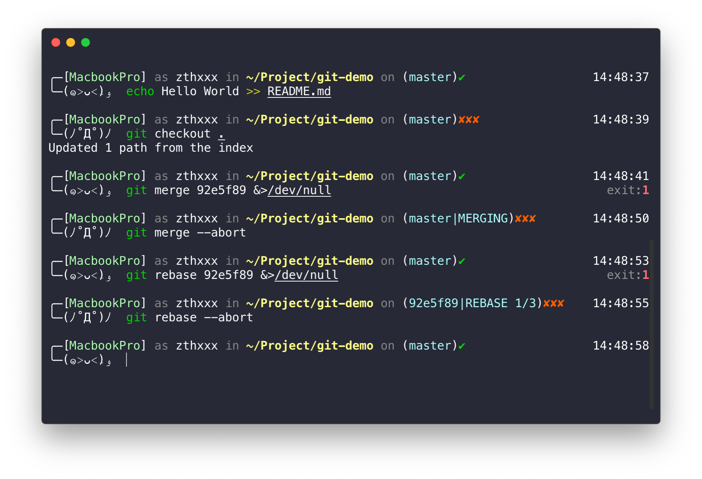
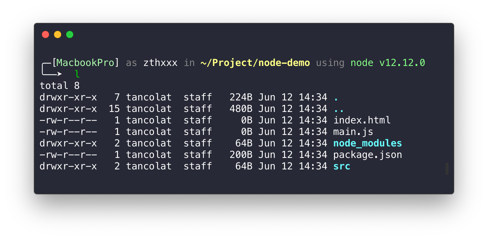
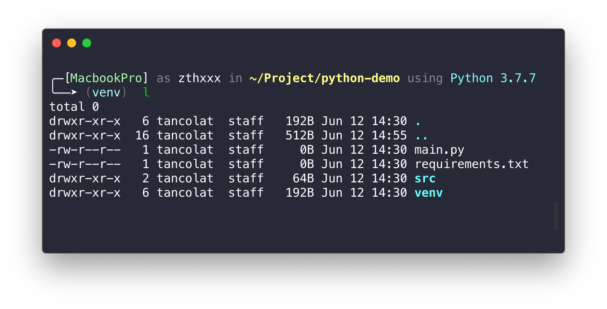

<h1 align="center">Jovial</h1>

<p align="center">fall in jovial with this theme</p>

## Preview


## Feature

- pretty face
- state
  - Host and User
  - current path
  - development environment segment
  - git branch, git action
  - time at the line end
  - venv
- plugin (auto be installed)
  - git
  - autojump
  - urltools
  - some alias (see [jovial.plugin](./jovial.plugin.zsh))

### git action tips



### development environment tips






## Install

**[for NOT root**]

```bash
curl -sSL https://github.com/zthxxx/jovial/raw/master/installer.zsh | sudo bash -s $USER
```


**[for root]** if you want install to **root** user, please make sure you are loggin as 'root' now, and use this command:


```bash
curl -sSL https://github.com/zthxxx/jovial/raw/master/installer.zsh | bash
```

NOTE: it will also install `zsh` and `oh-my-zsh` automatically.

## Font Recommended

- `Monaco` in iTerm2
- `Melon` in VSCode
- `JetBrains Mono` in JetBrains IDEs

NOTE: also remember to set font line-height to 1.0

## Author

**jovial** © [zthxxx](https://github.com/zthxxx), Released under the **[MIT](./LICENSE)** License.

> Blog [@zthxxx](https://blog.zthxxx.me) · GitHub [@zthxxx](https://github.com/zthxxx)
